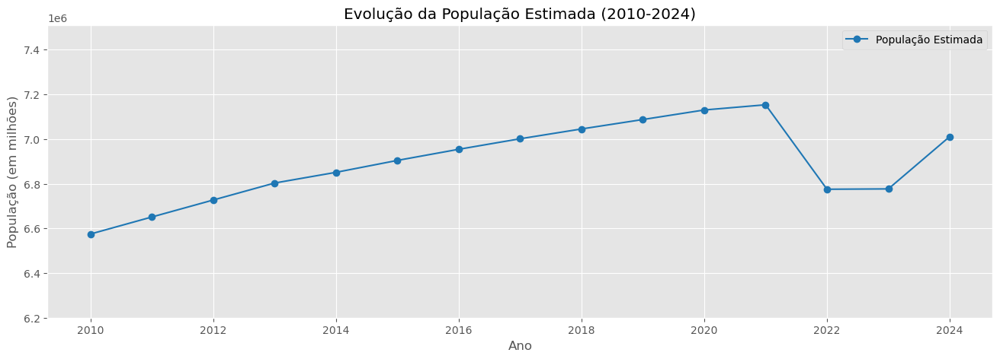
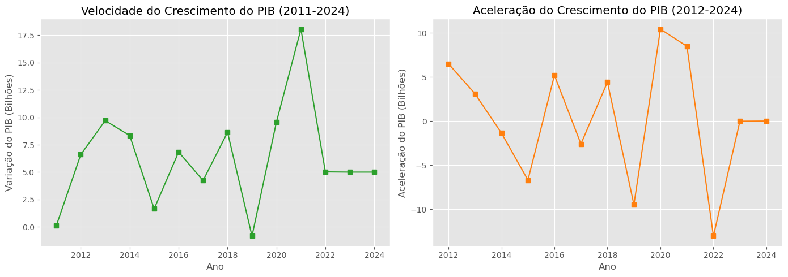
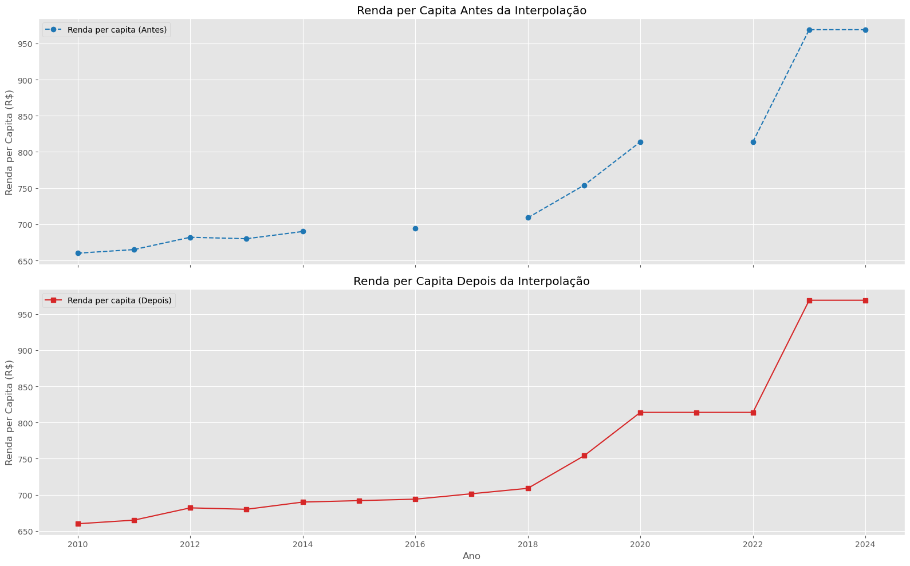
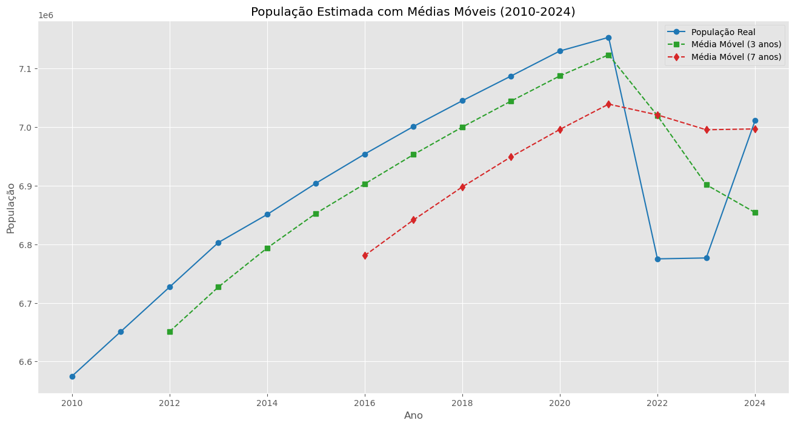

# 2º Desafio da Trilha de Ciência de Dados

**Data de Entrega:** 20/03/2025 <br>
**Local da Entrega:** Plataforma Trilhas

## Visão Geral do Projeto

Este repositório contém a resolução do **2º Desafio da Trilha de Ciência de Dados**, que foi dividido em duas partes:

- **Parte I - Algoritmo e Lógica de Programação:** Resolução de problemas lógicos utilizando **JavaScript** e **Python**.
- **Parte II - Análise de Dados:** Processamento, visualização e análise exploratória de dados do estado do Maranhão utilizando **Python (Jupyter Notebook)** e **Google Sheets**.

O link para a resolução no Google Sheets pode ser acessado [aqui](https://docs.google.com/spreadsheets/d/1GF9wyr_t_NzivIQZpGgixaIf38K2Vo4U3i6Y8rM_fJI/edit?gid=1477743634#gid=1477743634).

## Estrutura do Repositório

```
/
|-- algoritmo_e_logica/
|   |-- javascript/
|   |   |-- q_1.js
|   |   |-- q_2.js
|   |   |-- q_3.js
|   |   |-- ...
|   |-- python/
|   |   |-- q_1.py
|   |   |-- q_2.py
|   |   |-- q_3.py
|   |   |-- ...
|-- analise_de_dados/
|   |-- analise_dados_MA.ipynb
|   |-- assets/
|   |   |-- output-1.png
|   |   |-- output-2.png
|   |   |-- ...
|-- README.md
|-- Relatorio.md
|-- requirements.txt
```

## Parte I - Algoritmo e Lógica de Programação

As questões de lógica foram resolvidas utilizando **JavaScript** e **Python**. Abaixo estão alguns dos desafios resolvidos:

1. Criar um loop **while** para solicitar um número ao usuário até que ele digite **3**.
2. Criar um loop **do...while** para solicitar senha com limite de três tentativas.
3. Criar uma lista e exibir os valores na tela.
4. Criar funções matemáticas como **calcularQuadrado**, **Subtracao** e **mensagens personalizadas**.

Os arquivos correspondentes estão nas pastas `algoritmo_e_logica/javascript/` e `algoritmo_e_logica/python/`.

## Parte II - Análise de Dados com Python e Google Sheets

Nesta etapa, os dados do estado do Maranhão (2010-2024) foram analisados e visualizados. Os principais processos foram:

### 1. **Visualização dos Dados**
Foram criados gráficos de **População**, **PIB** e **Renda per Capita** para compreender as tendências:

- População Estimada
- PIB Estimado
- Renda per Capita



### 2. **Cálculo de Velocidade e Aceleração**
Foram calculadas as taxas de crescimento de população, PIB e renda:



### 3. **Interpolação de Dados**
Corrigimos os valores ausentes de **Renda per Capita** com **Interpolação Linear**:



### 4. **Médias Móveis**
Calculamos a **média móvel** (3 e 7 anos) para suavizar as séries temporais:



Os scripts da análise de dados estão no arquivo `analise_de_dados/analise_dados_MA.ipynb`.

## Como Reproduzir o Projeto

### **1. Clonar o Repositório**
```sh
git clone https://github.com/seu-usuario/desafio-2-trilhas-2b.git
cd desafio-2-trilhas-2b
```

### **2. Configurar o Ambiente**
Crie um ambiente virtual e instale as dependências:
```sh
python -m venv venv
source venv/bin/activate  # Linux/macOS
venv\Scripts\activate  # Windows
pip install -r requirements.txt
```

### **3. Executar os Scripts**
Para rodar os desafios de **JavaScript**, use **Node.js**:
```sh
cd algoritmo_e_logica/javascript
node q_1.js
```
Para rodar os desafios de **Python**:
```sh
cd algoritmo_e_logica/python
python q_1.py
```

### **4. Executar a Análise de Dados**
Abra o Jupyter Notebook:
```sh
cd analise_de_dados
jupyter notebook analise_dados_MA.ipynb
```

## Dependências
As bibliotecas utilizadas no projeto estão listadas em `requirements.txt`:
```txt
pandas
matplotlib
seaborn
numpy
jupyter
```

Para instalar as dependências:
```sh
pip install -r requirements.txt
```

## Conclusão

Este projeto abordou desafios de lógica de programação em **JavaScript** e **Python**, além de uma **análise de dados completa** do estado do Maranhão utilizando Python e Google Sheets.

Os insights extraídos demonstram tendências e padrões que podem ser útis para análises econômicas e sociais. Para mais detalhes, consulte o [relatório](Relatorio.md) e o [notebook](analise_de_dados/analise_dados_MA.ipynb).