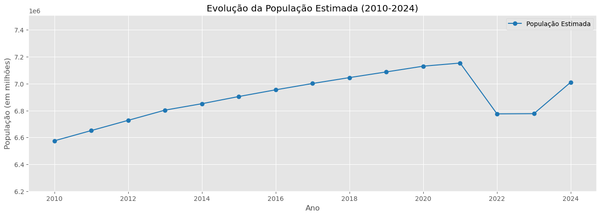

# Relatório de Análise de Dados - Estado do Maranhão

## Introdução
Este relatório apresenta a análise dos dados do Estado do Maranhão no período de 2010 a 2024, conforme solicitado no Desafio 2 - Trilhas 2B. Foram utilizadas técnicas estatísticas e de visualização de dados para explorar aspectos da população, PIB e renda per capita, com foco na estimativa de crescimento, velocidade, aceleração e medidas de dispersão.

## 1. Visualização dos Dados

Foram gerados gráficos de linhas para analisar as tendências das três principais variáveis:
- **População Estimada**: A população apresentou crescimento constante até 2021, com uma redução abrupta em 2022 e uma leve recuperação nos anos seguintes.

- **PIB Estimado**: Houve um crescimento geral do PIB, com pequenos períodos de estabilidade ou quedas mínimas.

- **Renda per Capita**: O crescimento da renda foi mais instável, apresentando lacunas nos dados que necessitaram de tratamento.

Os gráficos mostram claramente os padrões de crescimento e suas oscilações ao longo dos anos.

## 2. Cálculo da Velocidade e Aceleração

Foram calculadas as medidas de **velocidade** e **aceleração** para cada variável:
- **População**: A velocidade foi relativamente constante até 2021, quando houve uma brusca queda em 2022. A aceleração mostrou picos negativos significativos neste período.

- **PIB**: Oscilou ao longo dos anos, com períodos de crescimento e desaceleração.

- **Renda per Capita**: Apresentou instabilidades, com saltos significativos nos anos mais recentes, refletindo lacunas nos dados.

Os gráficos gerados demonstram claramente essas variações e ajudam a entender os padrões de crescimento ao longo do tempo.

## 3. Tratamento da Renda per Capita

Os dados da coluna **Renda per Capita** continham valores ausentes em diversos anos. Para corrigir essas lacunas, aplicamos **interpolação linear**, garantindo uma transição suave entre os valores conhecidos.

Os gráficos comparativos entre os dados antes e depois da interpolação mostram como a suavização eliminou as descontinuidades e melhorou a qualidade da análise.

## 4. Cálculo das Médias Móveis

Foram calculadas médias móveis com **janelas de 3 e 7 anos** para suavizar flutuações nas séries temporais:

Os gráficos mostram que a média móvel é eficiente para reduzir ruídos e melhorar a compreensão das séries.

## Conclusão

A análise dos dados do Estado do Maranhão entre 2010 e 2024 revelou padrões de crescimento populacional, econômico e de renda per capita. Os principais insights foram:
- **Crescimento contínuo da população** até 2021, seguido de uma queda abrupta em 2022.
- **PIB com crescimento sustentado**, apesar de algumas oscilações.
- **Renda per capita instável**, com lacunas que exigiram tratamento de dados.

As técnicas de **interpolação, médias móveis e medidas de dispersão** foram fundamentais para uma análise mais precisa. As visualizações geradas permitiram compreender melhor as tendências e padrões ao longo dos anos.

Esta abordagem analítica pode ser expandida com mais variáveis econômicas e sociais para aprofundar a compreensão do desenvolvimento do estado ao longo dos anos.